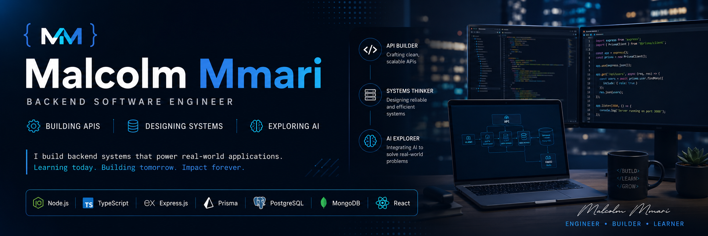

  

# Hi I'm Malcolm Mmari

  

🚀 About Me

I’m an early-career software engineer focused on backend development and system building.

I’ve been working professionally since October 2025 (~8 months), building real-world applications, APIs, and backend systems while continuously learning how production software is designed and scaled.

My strongest interest lies in backend engineering — designing the logic and systems that power applications.

🧠 What I Focus On
- 🔧 Backend Engineering (primary focus)
- 🔗 API Development (RESTful services)
- 🌐 Full-Stack Development (supporting frontend when needed)
- 🧠 System Design & Architecture (learning phase)
- 🤖 AI Integration into applications
- 🏗️ Building production-style software systems
  
⚙️ Tech Stack

### 💻 Languages

### ⚙️ Backend

### 🗄️ Databases

### 🌐 Frontend

### 🛠️ Tools

  
  
  

📊 GitHub Stats

   

## 🏆 GitHub Trophies

  

📈 Experience

Backend Software Engineer (Early Career)
📅 October 2025 – Present (~8 months)

What I’ve been doing:
Building backend-heavy applications and APIs
Working with authentication, roles, and permission systems
Structuring real-world backend services
Moving from learning → production-style development
Developing engineering discipline through real projects

🚀 Featured Projects

# 🔐 Role & Privilege Management API

Backend system for managing users, roles, and access control logic.

## ⚙️ API Development Systems

Modular REST APIs designed with clean backend architecture principles.

## 🌐 Full-Stack Applications (Backend-First)

Applications where backend logic drives system design.

## 🧪 AI Exploration Projects (Early Stage)

Experimenting with AI APIs and intelligent system integration.

## 🏢 Startup
💡 Mal-X Technologies

A growing software initiative focused on building clean, scalable digital systems.

Backend-heavy systems
Web & mobile applications
Practical software engineering solutions
Real-world client systems
🎯 Engineering Direction
Become a strong backend engineer
Master system design fundamentals
Build scalable production-grade APIs
Gain real AI engineering experience
Ship consistent real-world systems
Grow into a confident software systems builder

📈 Engineering Mindset

  

I focus on understanding how systems work, then building them piece by piece.
My approach:

Build first, refine continuously
Keep systems simple and maintainable
Learn through real projects, not theory alone
Focus on backend logic and system behavior

GitHub: https://github.com/colmBandit

## 📈 Contribution Activity

⚡ Closing Thought

I’m still early in my engineering journey, but I’m focused on becoming someone who can design and build real-world backend systems end-to-end.
